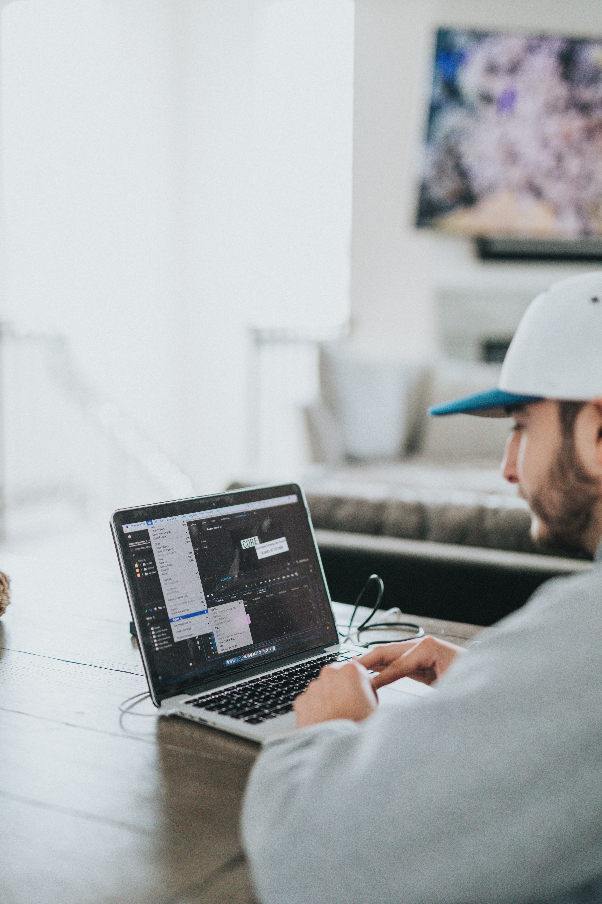
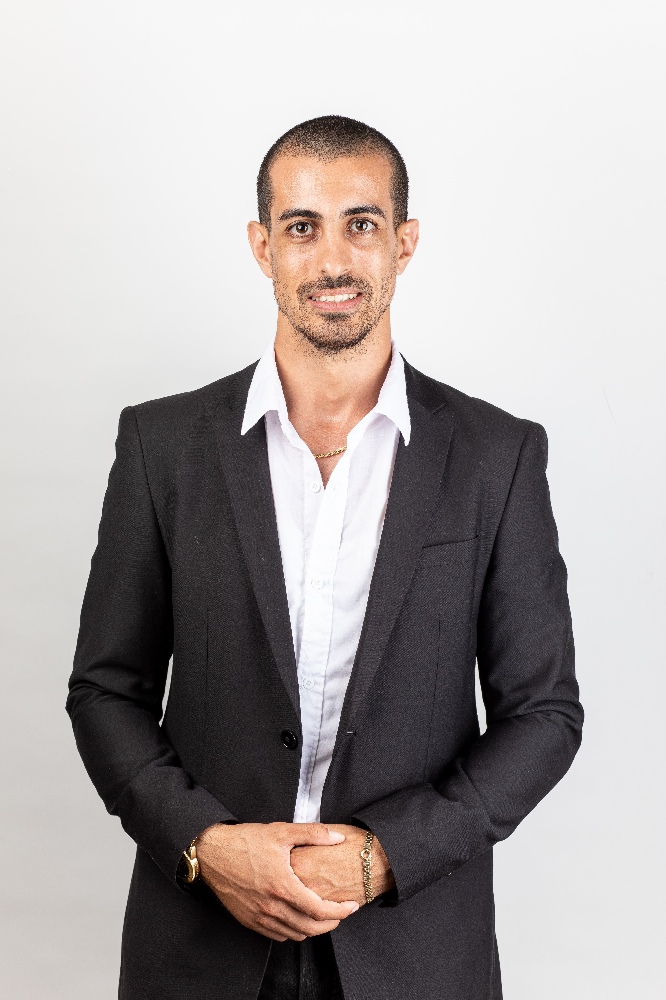

# Name:-Vedant Ravindra Domde
<<<<<<< HEAD

## Project Name:Developer portfolio

### My final website is below.

- Time Taken:3 hour 

## Technologies
#### Project is created with:
* HTML5
* CSS3
* flex

## Experience got on this project:-
         * Learn how to used flex in CSS
         * learn how to make webpage responsive using media query

  [Deploy link](https://vedantdomde.github.io/html-css-project9/) 
=======
2
​
3
## Project Name:project12
4
​
5
### My final website is below.
6
​
7
​
8
- Time Taken:4 hour 
9
​
10
## Technologies
11
#### Project is created with:
12
* HTML5
13
* CSS3
14
* flex
15
​
16
​
17
## Experience got on this project:-
18
         * Learn how to used flex in CSS
19
         * learn how to make webpage responsive using media query
20
​
21
​
22
  [Deploy link](https://vedantdomde.github.io/html-css-project12/) 
23
​
>>>>>>> a898bf33db9a21e525d60ba431d647ed6a3bede0
